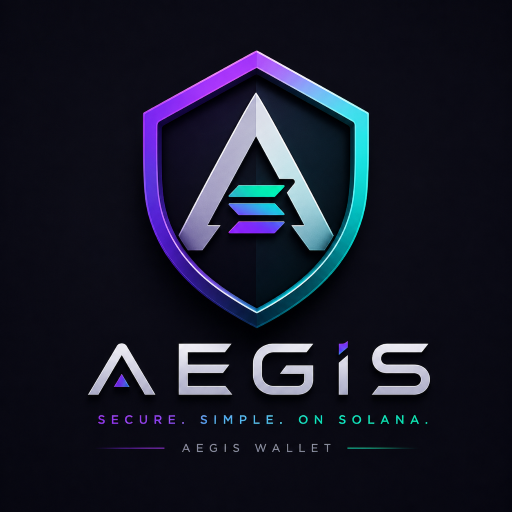
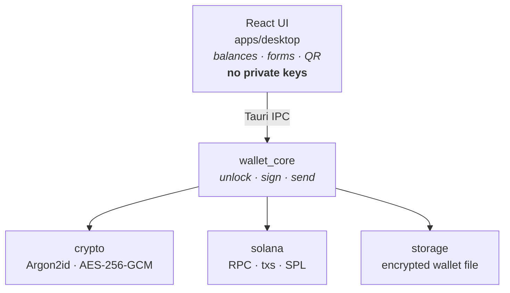
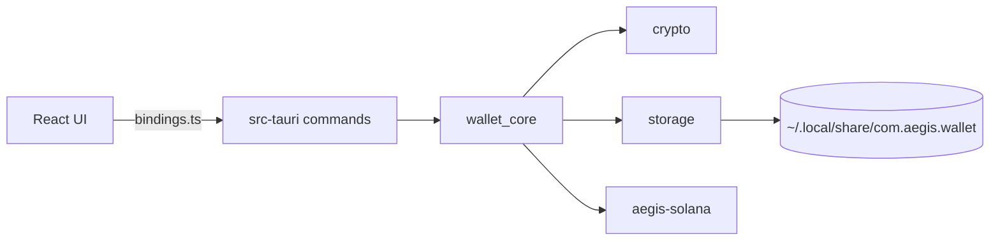

<p align="center">
  
</p>

<h1 align="center">Aegis</h1>

<p align="center">
  <strong>Secure. Simple. On Solana.</strong>
</p>

<p align="center">
  A non-custodial Solana desktop wallet for retail users — keys stay on your machine, signing stays in Rust.
</p>

<p align="center">
  <a href="#getting-started">Getting started</a> ·
  <a href="#features">Features</a> ·
  <a href="#security">Security</a> ·
  <a href="#architecture">Architecture</a> ·
  <a href="doc/CHANGELOG.md">Changelog</a> ·
  <a href="doc/SECURITY.md">Security policy</a>
</p>

---

## Why Aegis

Most wallets ask you to trust a browser tab or a hosted service. Aegis is a **native desktop app**: your seed phrase and private keys never leave your device, and every signature is produced inside a Rust core the UI cannot bypass.

Built with **Tauri v2** for a small footprint and **Solana SDK 4** for mainnet-ready transactions.

## Features

| | |
|---|---|
| **Create & import** | New wallet or recover from a 12/24-word seed phrase |
| **Balances** | SOL and SPL token holdings via RPC |
| **Send** | SOL and SPL transfers with fee preview and confirmation |
| **Receive** | Address display and QR code |
| **Activity** | Recent on-chain history |
| **Lock screen** | Password-gated unlock, signing, and seed reveal |

## Security

Aegis is designed so the frontend never becomes a secret keeper.



- **At rest:** Argon2id key derivation + AES-256-GCM encryption
- **In memory:** keys exist only while the wallet is unlocked
- **At sign time:** transactions are built and signed in Rust, not JavaScript
- **Seed reveal:** requires password verification every time

## Stack

| Layer | Technology |
|-------|------------|
| Shell | Tauri v2 |
| Core | Rust workspace — `crypto`, `storage`, `solana`, `wallet_core`, `models` |
| UI | React 19, TypeScript, Vite, Tailwind CSS 4 |
| Chain | Solana SDK 4, SPL token interfaces |
| Package manager | pnpm |

## Getting started

### Prerequisites

- [Rust](https://rustup.rs/) (stable)
- [Node.js](https://nodejs.org/) 20+
- [pnpm](https://pnpm.io/)
- [Tauri system dependencies](https://v2.tauri.app/start/prerequisites/) (Linux)

### Install & run

```bash
git clone <your-repo-url>
cd aegis/apps/desktop
pnpm install
pnpm tauri dev
```

### Optional: custom RPC

By default Aegis uses the public Solana mainnet RPC. For better reliability, point at your own endpoint:

```bash
cp ../../.env.example ../../.env
# AEGIS_RPC_URL=https://mainnet.helius-rpc.com/?api-key=YOUR_KEY
```

### Build

Production bundles (`.deb`, `.rpm`, `.AppImage` on Linux):

```bash
cd apps/desktop
pnpm tauri build
```

Output lands in `target/release/bundle/`.

### Test the Rust workspace

```bash
cd aegis
# Optional: if /tmp is small or quota-limited
mkdir -p .tmp && export TMPDIR=$PWD/.tmp
cargo test
```

## Architecture



| Crate | Responsibility |
|-------|----------------|
| `models` | Shared DTOs (+ specta types for TS bindings) |
| `crypto` | Argon2id + AES-256-GCM primitives only |
| `storage` | Persist `WalletFile` JSON to disk (does not encrypt) |
| `aegis-solana` | Keypairs, RPC, transfers |
| `wallet_core` | Session, encrypt/decrypt assembly, signing orchestration |
| `aegis-desktop` | Thin Tauri shell + IPC commands |

### Future extension points

| Growth | Where it goes |
|--------|----------------|
| Hardware / USB cold storage | New `crates/device` or module under `wallet_core` |
| Second chain | New `crates/<chain>` + `wallet_core` facade |
| Explorer links | Tauri opener + allowlisted capability |
| QR scan | Prefer native/Rust on Linux (not webview WebRTC) |

## Project structure

```
aegis/
├── apps/desktop/              # Tauri shell + React frontend
│   ├── src/bindings.ts        # generated by tauri-specta (do not hand-edit)
│   └── src-tauri/src/commands # wallet / balances / send
├── crates/
│   ├── crypto/                # Argon2id + AES-256-GCM
│   ├── models/                # shared types
│   ├── solana/                # RPC client, transfers, keypairs
│   ├── storage/               # wallet file persistence
│   └── wallet_core/           # session, signing, snapshots
└── doc/                       # project docs
    ├── AEGIS.png
    ├── CHANGELOG.md
    └── SECURITY.md
```

## Version

Current release: **0.1.2** — see [Changelog](doc/CHANGELOG.md).

## License

MIT
