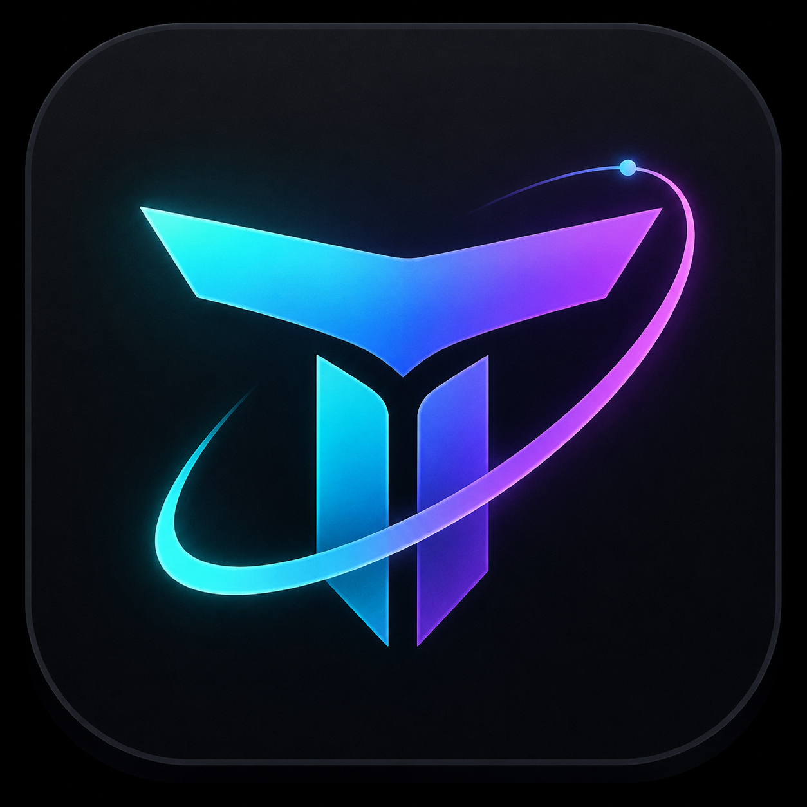
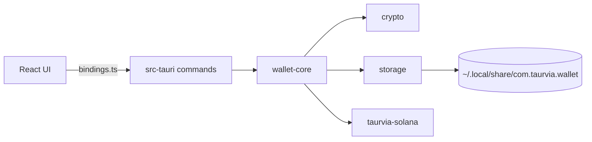

<p align="center">
  
</p>

<h1 align="center">Taurvia</h1>

<p align="center">
  <strong>Secure. Simple. On Solana.</strong>
</p>

<p align="center">
  A non-custodial Solana desktop wallet for retail users — keys stay on your machine, signing stays in Rust.
</p>

<p align="center">
  <a href="#getting-started">Getting started</a> ·
  <a href="#features">Features</a> ·
  <a href="#security">Security</a> ·
  <a href="#architecture">Architecture</a> ·
  <a href="doc/CHANGELOG.md">Changelog</a> ·
  <a href="doc/SECURITY.md">Security policy</a>
</p>

---

## Why Taurvia

Most wallets ask you to trust a browser tab or a hosted service. Taurvia is a **native desktop app**: your seed phrase and private keys never leave your device, and every signature is produced inside a Rust core the UI cannot bypass.

Built with **Tauri v2** for a small footprint and **Solana SDK 4** for mainnet-ready transactions.

## Features

| | |
|---|---|
| **Create & import** | New wallet or recover from a 12/24-word seed phrase |
| **Balances** | SOL and SPL holdings with USD prices and portfolio total |
| **Swap** | Any-to-any quote and execute via Jupiter (password-gated) |
| **Send** | SOL and SPL transfers with fee preview and confirmation |
| **Receive** | Address display and QR code |
| **Activity** | Recent on-chain history |
| **Lock screen** | Password-gated unlock, signing, and seed reveal |

## Security

Taurvia is designed so the frontend never becomes a secret keeper.


- **At rest:** Argon2id key derivation + AES-256-GCM encryption
- **In memory:** keys exist only while the wallet is unlocked
- **At sign time:** transactions are built and signed in Rust, not JavaScript
- **Seed reveal:** requires password verification every time

## Stack

| Layer | Technology |
|-------|------------|
| Shell | Tauri v2 |
| Core | Rust workspace — `crypto`, `storage`, `taurvia-solana`, `wallet-core`, `models` |
| UI | React 19, TypeScript, Vite, Tailwind CSS 4 |
| Chain | Solana SDK 4, SPL token interfaces |
| Package manager | pnpm |

## Getting started

### Prerequisites

- [Rust](https://rustup.rs/) (stable)
- [Node.js](https://nodejs.org/) 20+
- [pnpm](https://pnpm.io/)
- [Tauri system dependencies](https://v2.tauri.app/start/prerequisites/) (Linux)

### Install & run

```bash
git clone <your-repo-url>
cd taurvia/apps/desktop
pnpm install
pnpm tauri dev
```

### Optional: custom RPC and Jupiter

By default Taurvia uses the public Solana mainnet RPC and keyless Jupiter APIs. For better reliability or higher rate limits:

```bash
cp ../../.env.example ../../.env
# TAURVIA_RPC_URL=https://mainnet.helius-rpc.com/?api-key=YOUR_KEY
# TAURVIA_JUPITER_API_KEY=YOUR_PORTAL_KEY   # free at https://portal.jup.ag
```

### Build

Local builds produce packages for the **host OS only**. On Linux that means `.deb`, `.rpm`, and `.AppImage`:

```bash
cd apps/desktop
pnpm tauri build
```

Output lands in `target/release/bundle/`.

Windows (`.msi` / NSIS) and macOS (`.dmg` / `.app`) are built unsigned by the [Desktop build](.github/workflows/desktop-build.yml) GitHub Actions workflow on `main` pushes or manual dispatch (not on PRs). Download the `taurvia-*-unsigned` artifacts from the workflow run. These builds are not code-signed or notarized.
### Test the Rust workspace

```bash
cd taurvia
# Optional: if /tmp is small or quota-limited
mkdir -p .tmp && export TMPDIR=$PWD/.tmp
cargo test
```

## Architecture



| Crate | Responsibility |
|-------|----------------|
| `models` | Shared DTOs (+ specta types for TS bindings) |
| `crypto` | Argon2id + AES-256-GCM primitives only |
| `storage` | Persist `WalletFile` JSON to disk (does not encrypt) |
| `taurvia-solana` | Keypairs, RPC, transfers |
| `wallet-core` | Session, encrypt/decrypt assembly, signing orchestration |
| `taurvia-desktop` | Thin Tauri shell + IPC commands |

### Future extension points

| Growth | Where it goes |
|--------|----------------|
| Hardware / USB cold storage | New `crates/device` or module under `wallet-core` |
| Second chain | New `crates/<chain>` + `wallet-core` facade |
| Explorer links | Tauri opener + allowlisted capability |
| QR scan | Prefer native/Rust on Linux (not webview WebRTC) |

## Project structure

```
taurvia/
├── apps/desktop/              # Tauri shell + React frontend
│   ├── src/bindings.ts        # generated by tauri-specta (do not hand-edit)
│   └── src-tauri/src/commands # wallet / balances / send / swap
├── crates/
│   ├── crypto/                # Argon2id + AES-256-GCM
│   ├── models/                # shared types
│   ├── taurvia-solana/          # RPC, transfers, Jupiter price/swap
│   ├── storage/               # wallet file persistence
│   └── wallet-core/           # session, signing, snapshots, swap
└── doc/                       # project docs
    ├── TAURVIA.png
    ├── CHANGELOG.md
    └── SECURITY.md
```

## Version

Current release: **0.4.0** — see [Changelog](doc/CHANGELOG.md).

## License

MIT
