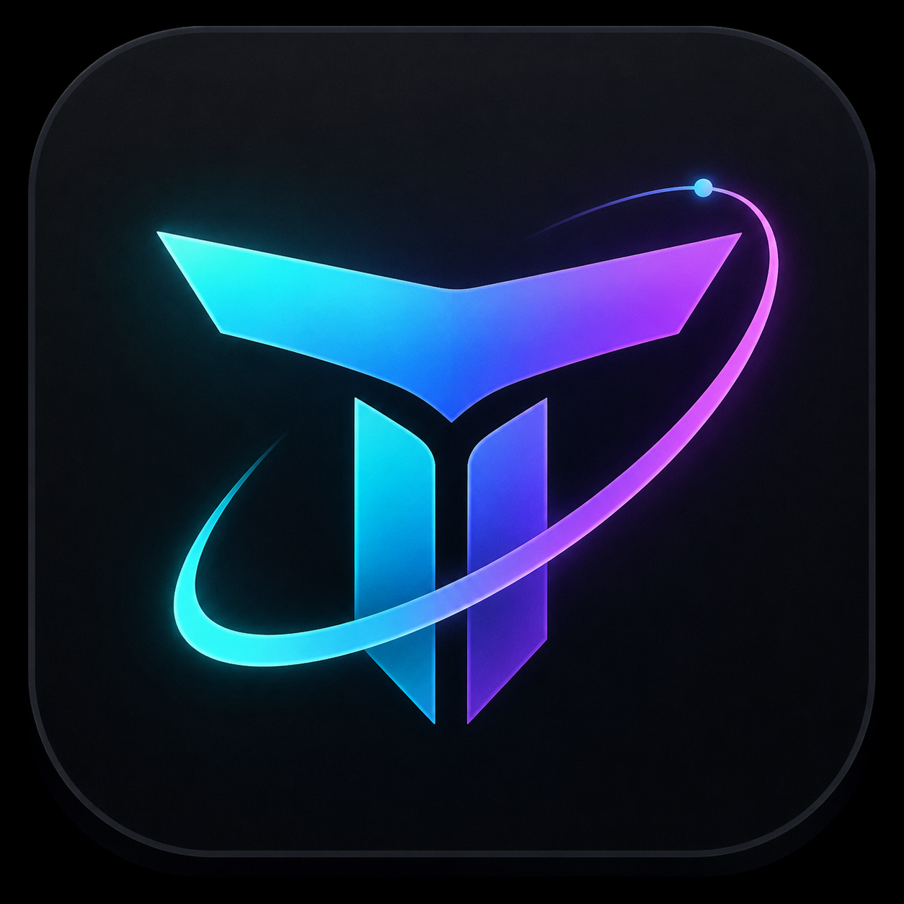
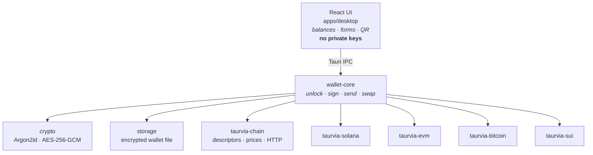
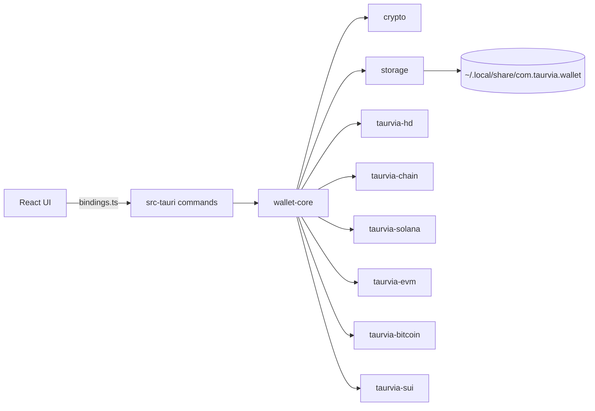

<p align="center">
  
</p>

<h1 align="center">Taurvia</h1>

<p align="center">
  <strong>Secure. Simple. On your machine.</strong>
</p>

<p align="center">
  A non-custodial desktop wallet — keys stay on your machine, every signature is produced in Rust.
  Solana, Ethereum, Bitcoin, and Sui from one seed (or a single private key).
</p>

<p align="center">
  <a href="#getting-started">Getting started</a> ·
  <a href="#features">Features</a> ·
  <a href="#security">Security</a> ·
  <a href="#architecture">Architecture</a> ·
  <a href="doc/CHANGELOG.md">Changelog</a> ·
  <a href="doc/SECURITY.md">Security policy</a>
</p>

---

## Why Taurvia

Most wallets ask you to trust a browser tab or a hosted service. Taurvia is a **native desktop app**: your seed phrase and private keys never leave your device, and every signature is produced inside a Rust core the UI cannot bypass.

Built with **Tauri v2**. One BIP39 phrase derives Solana, Ethereum, Bitcoin, and Sui. Importing a raw private key unlocks that family only. Not a dApp browser, not WalletConnect, and no JavaScript key material.

## Features

| | |
|---|---|
| **Create & import** | New seed → account name + password (no quiz). Restore with a 12/24-word phrase, a private key (Solana / Ethereum / Bitcoin WIF / Sui `suiprivkey1…`), or Taurvia JSON. Hardware wallet listed as coming soon |
| **Portfolio** | Activated mainnets together — one USD total, then native + tokens per chain. New mnemonic wallets include Sui; existing wallets keep their saved list until you turn Sui on in Settings |
| **Swap** | Jupiter on Solana, 0x on Ethereum, Thorchain when Bitcoin is the source. Sui has no swap. Quotes and signatures stay in Rust; password-gated |
| **Send / receive** | Last-used chain for the address, then the asset. Rust preview: network, full recipient, amount, fee |
| **Activity** | Recent on-chain history |
| **Lock screen** | Password-gated unlock, signing, and seed reveal (seed reveal is hidden for key-only wallets) |

## Security

Taurvia is designed so the frontend never becomes a secret keeper.


```mermaid
flowchart TB
  UI["React UI<br/>apps/desktop<br/><i>balances · forms · QR</i><br/><b>no private keys</b>"]
  WC["wallet-core<br/><i>unlock · sign · send · swap</i>"]
  CRYPTO["crypto<br/>Argon2id · AES-256-GCM"]
  REG["taurvia-chain<br/>descriptors · prices · HTTP"]
  SOL["taurvia-solana"]
  EVM["taurvia-evm"]
  BTC["taurvia-bitcoin"]
  SUI["taurvia-sui"]
  STORE["storage<br/>encrypted wallet file"]

  UI -->|Tauri IPC| WC
  WC --> CRYPTO
  WC --> STORE
  WC --> REG
  WC --> SOL
  WC --> EVM
  WC --> BTC
  WC --> SUI
```

- **At rest:** Argon2id (+ optional OS keychain device binding) + AES-256-GCM — **one envelope** for the mnemonic or imported key
- **In memory:** family signers only while unlocked — recovery phrase is not kept in session RAM; lock drops and zeroizes the keyring
- **Key-only wallets:** a Solana, Ethereum, Bitcoin, or Sui key cannot derive the other families; other chains cannot be activated; reveal seed is hidden
- **At sign time:** transactions (including Jupiter, 0x, and Thorchain BTC sends) are built and signed in Rust, not JavaScript
- **Wrong-chain sends:** Rust rejects `0x` 40-hex on Solana/Sui, `bc1` on Ethereum, base58 on Bitcoin, Sui 64-hex on Ethereum, etc.
- **Seed reveal:** re-decrypts from disk with password every time
- **Details:** see [`doc/SECURITY.md`](doc/SECURITY.md) (device protection, backup vs seed restore, multi-family session)

## Stack

| Layer | Technology |
|-------|------------|
| Shell | Tauri v2 |
| Core | Rust workspace — `crypto`, `storage`, `taurvia-hd`, `taurvia-chain`, `taurvia-solana`, `taurvia-evm`, `taurvia-bitcoin`, `taurvia-sui`, `wallet-core`, `models` |
| UI | React 19, TypeScript, Vite, Tailwind CSS 4 |
| Chains | Solana SDK 4 + SPL; alloy (EVM); bitcoin 0.32 Native SegWit; Sui SLIP-0010 Ed25519 + JSON-RPC |
| Package manager | pnpm |

## Getting started

### Prerequisites

- [Rust](https://rustup.rs/) (stable)
- [Node.js](https://nodejs.org/) 20+
- [pnpm](https://pnpm.io/)
- [Tauri system dependencies](https://v2.tauri.app/start/prerequisites/) (Linux)

### Install & run

```bash
git clone https://github.com/antonpiat/taurvia.git
cd taurvia/apps/desktop
pnpm install
pnpm tauri dev
```

### Optional: custom RPC

By default Taurvia uses a **managed public RPC** per enabled network (Settings → Network). Swap runs on Solana, Ethereum, and Bitcoin mainnets (Jupiter / 0x / Thorchain) — not Sui. For better reliability or higher rate limits:

```bash
cp ../../.env.example ../../.env
# TAURVIA_RPC_URL=https://mainnet.helius-rpc.com/?api-key=YOUR_KEY
# TAURVIA_ETH_RPC_URL=https://eth.llamarpc.com
# TAURVIA_BTC_ESPLORA_URL=https://blockstream.info/api
# TAURVIA_SUI_RPC_URL=https://sui-rpc.publicnode.com
# TAURVIA_JUPITER_API_KEY=YOUR_PORTAL_KEY   # free at https://portal.jup.ag
# TAURVIA_0X_API_KEY=YOUR_0X_KEY            # optional; also Settings → Advanced
```

`TAURVIA_RPC_URL` overrides the managed Solana default. Ethereum, Bitcoin, and Sui have their own env keys. Settings → Advanced is still per-network.

Sui defaults to [PublicNode](https://sui-rpc.publicnode.com) JSON-RPC. Mysten public fullnodes no longer serve JSON-RPC (gRPC/GraphQL only).

### Build

Local builds produce packages for the **host OS only**. On Linux that means `.deb`, `.rpm`, and `.AppImage`:

```bash
cd apps/desktop
pnpm tauri build
```

Output lands in `target/release/bundle/`.

[CI](.github/workflows/ci.yml) runs `cargo test` and TypeScript checks on every pull request and every push to `main`. It does not package installers.

Installers (Linux `.deb` / `.rpm` / `.AppImage`, Windows `.msi` / NSIS, macOS `.dmg`) are produced by [Release](.github/workflows/release.yml) only when you push a `vX.Y.Z` tag whose commit is on `main` and already has a green CI run. Assets land on the GitHub Release. These builds are not code-signed or notarized yet.

### Test the Rust workspace

From the repo root:

```bash
# Optional: if /tmp is small or quota-limited
mkdir -p .tmp && export TMPDIR=$PWD/.tmp
cargo test
```

## Architecture


```mermaid
flowchart LR
  UI["React UI"] -->|bindings.ts| Shell["src-tauri commands"]
  Shell --> WC["wallet-core"]
  WC --> CRYPTO["crypto"]
  WC --> STORE["storage"]
  WC --> HD["taurvia-hd"]
  WC --> REG["taurvia-chain"]
  WC --> SOL["taurvia-solana"]
  WC --> EVM["taurvia-evm"]
  WC --> BTC["taurvia-bitcoin"]
  WC --> SUI["taurvia-sui"]
  STORE --> DISK[("~/.local/share/com.taurvia.wallet")]
```

| Crate | Responsibility |
|-------|----------------|
| `models` | Shared DTOs, `NetworkDescriptor` table (+ specta types) |
| `crypto` | Argon2id + AES-256-GCM primitives only |
| `storage` | Persist `WalletFile` JSON to disk (does not encrypt) |
| `taurvia-hd` | BIP39 generate / validate / seed (no IPC) |
| `taurvia-chain` | Registry, address-family checks, shared HTTP + prices (no chain SDKs) |
| `taurvia-solana` | Solana RPC, SPL, Jupiter swap |
| `taurvia-evm` | alloy provider, EIP-1559, ERC-20, 0x swap |
| `taurvia-bitcoin` | BIP84 Native SegWit, Esplora, Thorchain quote + inbound send |
| `taurvia-sui` | SLIP-0010 Ed25519, JSON-RPC balances / PaySui, Suiscan |
| `wallet-core` | Session, encrypt/decrypt, password-gated dispatch **by family**, parallel portfolio snapshot |
| `taurvia-desktop` | Thin Tauri shell + IPC commands |

### Derivation (compatibility, not product identity)

Same BIP39 seed as Phantom / MetaMask / typical BIP84 wallets. Tests live next to the derivation code. A raw imported key does not use these paths.

| Family | Path | Address |
|--------|------|---------|
| Solana | `m/44'/501'/0'/0'` | base58 |
| Ethereum (and later Polygon/Base) | `m/44'/60'/0'/0/0` | EIP-55 `0x…` |
| Bitcoin | `m/84'/0'/0'/0/0` (testnet `m/84'/1'/0'/0/0`) | Native SegWit `bc1q` / `tb1q` |
| Sui | SLIP-0010 `m/44'/784'/0'/0'/0'` | `0x` + 64 hex |

### Adding a network

| You want | What to change |
|---------|----------------|
| **Polygon / Base** (or another EVM L2) | One `NetworkDescriptor` row: RPC, `eip155_chain_id`, explorer, token list, `enabled: true`. Same `EvmSigner`. No new crate. |
| **A new VM** | New `crates/taurvia-*` implementing the chain backend, `ChainFamily` variant, `FamilyKeyring` field. UI picks it up from `list_networks()`. |

Signing still cannot move to JavaScript. Disabled stubs already exist for `polygon-mainnet`, `polygon-amoy`, `base-mainnet`, and `base-sepolia`.

### Future extension points

| Growth | Where it goes |
|--------|----------------|
| Hardware / USB cold storage | New `crates/device` or module under `wallet-core` (import UI already shows it as coming soon) |
| WalletConnect / dApp browser | **Out of scope** — would invert “the UI cannot bypass Rust” |
| Explorer links | Solana: Settings (Solscan / Solana Explorer). Other families: descriptor `explorer_tx` |
| QR scan | Prefer native/Rust on Linux (not webview WebRTC) |

## Project structure

```
taurvia/
├── apps/desktop/              # Tauri shell + React frontend
│   ├── src/bindings.ts        # generated by tauri-specta (do not hand-edit)
│   └── src-tauri/src/commands # wallet / balances / send / swap
├── crates/
│   ├── crypto/                # Argon2id + AES-256-GCM
│   ├── models/                # shared types + network descriptors
│   ├── taurvia-hd/            # BIP39
│   ├── taurvia-chain/         # registry, mismatch checks, prices
│   ├── taurvia-solana/        # RPC, transfers, Jupiter
│   ├── taurvia-evm/           # alloy, EIP-1559, ERC-20, 0x
│   ├── taurvia-bitcoin/       # BIP84, Esplora, Thorchain
│   ├── taurvia-sui/           # SLIP-0010 Ed25519, Sui JSON-RPC
│   ├── storage/               # wallet file persistence
│   └── wallet-core/           # session, signing, snapshots, swap
└── doc/                       # project docs
    ├── TAURVIA.png
    ├── CHANGELOG.md
    └── SECURITY.md
```

## Version

Current release: **0.5.2** — see [Changelog](doc/CHANGELOG.md).

## License

MIT
